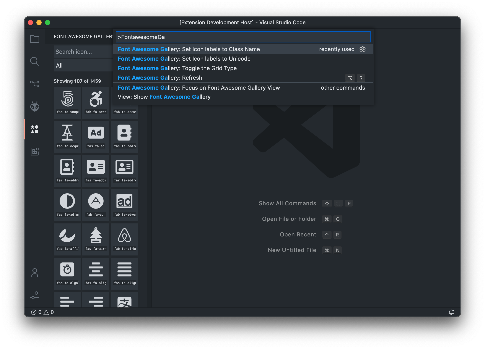

# Font Awesome Gallery

VSCode Sidebar Panel with a gallery view of FontAwesome's 5/6 free icons.

## Features ✅

- Icon search box to find icons by name or keyword.
- Category selector to filter icons by available categories.
- Allows you to copy the icon code by clicking on any icon.
- Detailed icon information on hover.
- Grid or List view mode.
- Change between the icon's class name or the unicode code-point.

## Installation 💾

| Installation Type | Platform / Link                                                                                                                                                                       |
| ----------------- | ------------------------------------------------------------------------------------------------------------------------------------------------------------------------------------- |
| **VS Code**]      |  |
| `.vsix` file      |                        |

## Running locally 💻

> ⚠️ Only recommended for development.

1. Clone the repo.
2. Run `npm install` to install deps.
3. Press `F5` to start VSCode Debugger which launches an **_Extension Development Host_** with the extension enabled.
   > 🙋 If an error occurs try running `npm run watch` before starting the debugger

## How to use 🧐

The extension is pretty easy to use and works as a sidebar panel:

- Hover an icon to get a detailed description.
- Click an icon to copy the icon code.
- Search in the `Search icon` input to filter icons by name or related keyword.
- Filter by category using the category selector.
- The extension initially loads ~100 icons, to load more click the button at the end of the list.
- Use the command palette's options to toggle between class name or unicode code-point.
- **Use the three-dots menu or the command palette to change between Font Awesome 5 or 6.**

### Command Palette Options

You can control most of the extension options from the command palette.

- Use the `Toggle the Grid Type` command to change between the icons grid or icon list views.
- Use the `Set Icon labels to Unicode` command to change the labels and the copy feature to unicode code-points.
- Use the `Set Icon labels to Class Name` command to use the standard class name format.
- Use the `Switch to FA 5` command to use Font Awesome 5.
- Use the `Switch to FA 6` command to use Font Awesome 6.

## Changelog

See [CHANGELOG.md](https://github.com/TOMIVERGARA/vscode-fontawesome-gallery/blob/master/CHANGELOG.md)

## License

See [LICENSE](https://github.com/TOMIVERGARA/vscode-fontawesome-gallery/blob/master/LICENCE)
