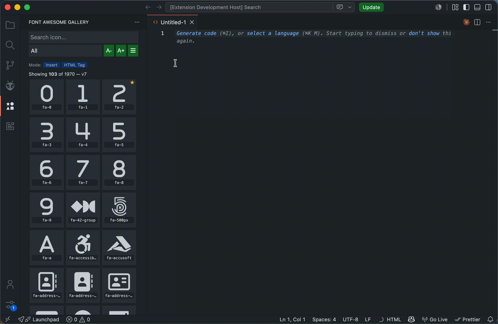
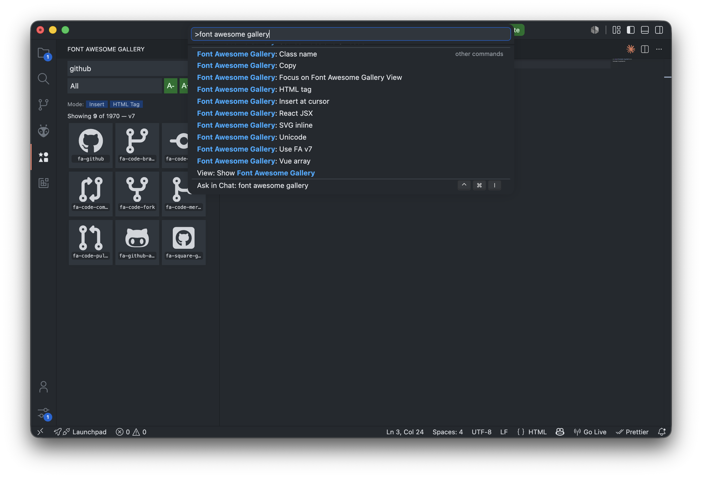

# Font Awesome Gallery

> Browse, search, and copy Font Awesome icons without ever leaving VS Code.

[](https://marketplace.visualstudio.com/items?itemName=tomasvergara.vscode-fontawesome-gallery)
[](https://marketplace.visualstudio.com/items?itemName=tomasvergara.vscode-fontawesome-gallery)
[](https://fontawesome.com)
[](https://fontawesome.com)
[](https://fontawesome.com)



---

## What is this?

Font Awesome Gallery is a VS Code sidebar extension that puts the entire Font Awesome free icon library at your fingertips. Search icons by name or keyword, browse by category, and copy the exact format your project needs — all without switching context.

Version 1.0.0 is the biggest update in the extension's history. After 4 years, the entire codebase has been rewritten from the ground up: new build system, Svelte 5, FA v7 support, and a long list of features requested by the community.

---

## Features

### Icon Browsing

- **FA v5, v6, and v7 support**: switch between versions from the command palette or toolbar
- **Smart search**: find icons by name, label, or keyword with weighted ranking (name matches come first)
- **Category filter**: browse by any of the official FA categories
- **Grid and List view**: toggle between a compact grid and a detailed list
- **Icon size controls**: use the A- / A+ buttons in the toolbar to resize icons to your liking
- **"New" badge**: icons added in recent Font Awesome releases are marked so you always know what's new

### Favorites and Recents

- **Favorites**: click the heart on any icon to save it; filter your favorites from the category selector
- **Recent icons**: the last 20 icons you interacted with are tracked automatically and available as a filter

### Copy and Insert

Click any icon to trigger your configured action. Right-click (or long-press) to open a context menu with every available format:

| Format     | Example                                     |
| ---------- | ------------------------------------------- |
| Class name | `fa-solid fa-heart`                         |
| HTML tag   | `<i class="fa-solid fa-heart"></i>`         |
| React JSX  | `<FontAwesomeIcon icon={faHeart} />`        |
| Vue array  | `['fas', 'heart']`                          |
| Unicode    | `&#xf004;`                                  |
| SVG inline | Full `<svg>` markup, no dependency required |

- **Insert at cursor**: instead of copying, paste the icon code directly into your active editor at the cursor position
- **Configurable click behavior**: set the primary click to copy or insert from the command palette

### UX Details

- **Hover tooltip**: see the icon name, class code, unicode value, and all available styles on hover
- **Open on fontawesome.com**: jump to the official icon page directly from the tooltip
- **Keyboard navigation**: move between icons with the arrow keys and activate with Enter
- **Infinite scroll**: the gallery loads icons progressively as you scroll; no "Load more" button
- **Persistent settings**: your preferences (version, view mode, click behavior, favorites, recents) survive across VS Code sessions
- **FA v5 deprecation notice**: a subtle banner reminds you that Font Awesome 5 is no longer maintained

---

## Installation

Search for **Font Awesome Gallery** in the VS Code Extensions panel, or install it directly from the Marketplace:

[](https://marketplace.visualstudio.com/items?itemName=tomasvergara.vscode-fontawesome-gallery)

---

## Command Palette

All extension settings are available from the command palette (`Ctrl+Shift+P` / `Cmd+Shift+P`). Search for `Font Awesome`:

| Command                                                          | Description                            |
| ---------------------------------------------------------------- | -------------------------------------- |
| Use FA 5 / 6 / 7                                                 | Switch the active Font Awesome version |
| Toggle Grid Type                                                 | Switch between grid and list view      |
| Set Click: Copy                                                  | Primary click copies the icon code     |
| Set Click: Insert                                                | Primary click inserts at the cursor    |
| Set Copy Content: Classname / HTML / React / Vue / Unicode / SVG | Choose the default copy format         |
| Set Icon Labels: Class Name / Unicode                            | Change the label shown under each icon |



---

## Running Locally

1. Clone the repository.
2. Run `npm install`.
3. Run `npm run watch` to start the esbuild watcher.
4. Press `F5` to launch a VS Code Extension Development Host with the extension loaded.

```bash
npm install
npm run compile
npm run watch   # keep this running
# then press F5 in VS Code
```

To regenerate the icon data from the official FA npm packages:

```bash
npm run build:icons
```

---

## Changelog

See [CHANGELOG.md](CHANGELOG.md) for the full version history.

## License

See [LICENSE](LICENCE) for license details.
